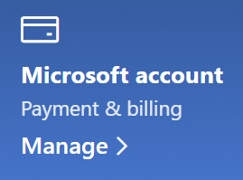

# Promena informacija o Microsoft nalogu

Idite na [https://account.microsoft.com](https://account.microsoft.com/) i prijavite se ako je potrebno. To će vas odvesti na tablu naloga.  

**Uređivanje mog imena i ličnih informacija**

1. Na dashboard naloga, pored slike i imena naloga izaberite stavku Još radnji > **Uredi profil.**
2. Na stranici **Uređivanje profila** koristite obezbeđene veze da biste promenili sliku profila, ime, datum rođenja, lokaciju i željene postavke jezika prikaza. Omete veze ka profilima Xbox ili Skype naloga, gde možete da promenite detalje specifične za ove naloge.

**Upravljanje e-adresama i brojevima telefona**

Microsoft nalog ima jednu ili više e-adresa ili brojeva telefona povezanih sa njim kao "pseudonimi". Da biste upravljali ovim:

1. Na dashboard naloga, pored slike i imena naloga izaberite stavku Još radnji > **Uredi profil.**
2. Na stranici Uređivanje **profila** izaberite stavku **Upravljaj načinom na koji se prijavujete u Microsoft .** 
3. Videćete listu pseu dana naloga, a možete i da upravljate listom, uključujući dodavanje i brisanje adresa e-pošte i brojeva telefona. Ovde možete izabrati koji pseudonimi mogu da se koriste za prijavljivanje na nalog i koji se pseudonim smatra "primarnim", koji će se prikazati na Windows 10 uređajima.

**Upravljanje načinima plaćanja, kao i imenom i adresom za naplatu** 

1. Na dashboard naloga, pored slike i imena naloga izaberite stavku Još radnji > **Uredi profil.**
2. U **okviru stavke & naplatu izaberite** **stavku Upravljaj**.

    

3. Ovde možete dodati, urediti i ukloniti načine plaćanja i njihove povezane adrese za naplatu. 
