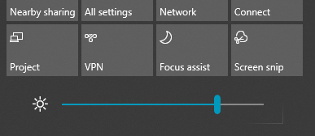

# Promena osvetljenosti ekrana u operativnom sistemu Windows 10Change screen brightness in Windows 10

Ako je Windows 10 noviji od verzije 1903, on u centru aktivnosti ima klizač "Osvetljenost". If your Windows 10 is newer than version 1903, it has a **Brightness slider** in the action center. Da biste otvorili centar  za obaveštenja, kliknite na dugme Obaveštenje na desnoj strani trake zadataka ili pritisnite **kombinaciju** tastera Windows home + A na tastaturi.To open the action center, click the **Notification** button at the rightmost side of your taskbar, or press **Windows home + A** on your keyboard.

Ako je vaš Windows 10 starija verzija, klizač za osvetljenost možete da pronađete tako što ćete ići na Postavke **[> System > Display](ms-settings:display?activationSource=GetHelp)**.If your Windows 10 is an earlier version, you can find the brightness slider by going to **[Settings > System > Display](ms-settings:display?activationSource=GetHelp)**.

**Napomene:****Notes**:

- Možda ne vidite klizač "Promena osvetljenosti" za ugrađeni klizač za prikaz na stonim računarima koji imaju eksterni monitor.You might not see the Change brightness for the built-in display slider on desktop PCs that have an external monitor. Da biste promenili svetlinu spoljnog monitora, koristite kontrole na monitoru.To change the brightness of an external monitor, use the controls on the monitor.
- Ako nemate stoni računar, a klizač se ne pojavljuje ili ne radi, pokušajte da ažuriranje upravljačkog programa za ekran.If you don't have a desktop PC and the slider doesn't appear or work, try updating the display driver. U polje za pretragu na traci zadataka  otkucajte Upravljač **uređajima**, a zatim sa liste rezultata izaberite stavku Upravljač uređajima.In the search box on the taskbar, type **Device Manager**, and then select **Device Manager** from the list of results. U **upravljaču uređajima** izaberite **Video adapteri**, a zatim izaberite video adapter.In **Device Manager**, select **Display adapters**, then select the display adapter. Pritisnite i držite ime video adaptera (ili kliknite desnim tasterom miša na njegovo ime) i izaberite stavku **Ažuriraj upravljački program**; a zatim sledite uputstva.Press and hold (or right-click) the display adapter name and click **Update driver**; then follow the instructions.
