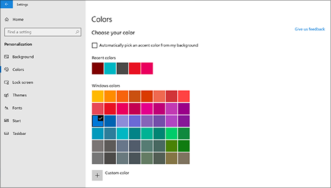
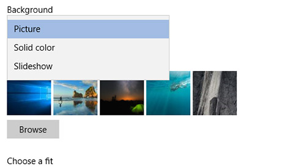

# Promena pozadine radne površine i boja

Da biste promenili postavke boja, izaberite stavku Start Postavke Personalizacija boja , a zatim odaberite svoju boju ili pustite Windows da povuče boju naglašavanje  >    >    >  sa vaše pozadine.

Da biste promenili pozadinu radne površine, idite na početnu pozadinu za personalizaciju postavki , a zatim odaberite sliku, neprobojnu boju ili kreirajte projekciju  >    >    >  slajdova sa slikama. 

Želite više pozadina radne površine i boja? Posetite [Microsoft Store](https://www.microsoft.com/store/collections/windowsthemes) da biste odabrali jednu od brojnih besplatnih tema.
