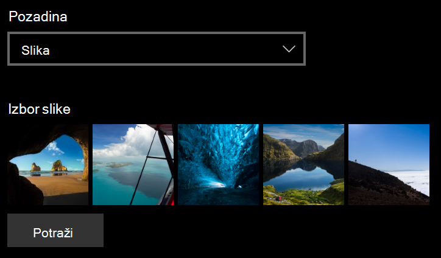
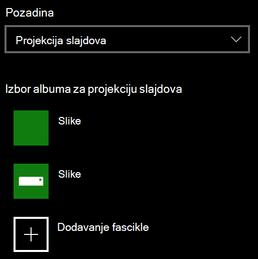

# Promena pozadine zaključanog ekrana

- Idite na **Settings**  >  ekran za zaključavanje**personalizacije**postavki  >  **Lock screen**. Ili dodirnite ili dodirnite [ovde](ms-settings:lockscreen?activationSource=GetHelp).

- Da biste odredili prilagođenu sliku u pozadini, izaberite stavku **slika** sa padajuće liste **pozadine** i odaberite ili **potražite** sliku.

  

- Da biste podesili projekciju slajdova prilagođenih slika, izaberite stavku **Projekcija slajdova** sa padajuće liste u **pozadini** i odaberite album ili dodajte fasciklu koja sadrži slike za projekciju slajdova.

  
