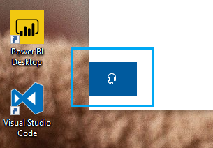

# Obratite nam se tako što ćete kliknuti na dugme za slušanje

Ako želite da se obratite Microsoft podršci, kliknite na **kontakt sa nama** u donjem levom uglu ove aplikacije. U prozoru "razleti", bićete vođeno na kanalu za podršku nakon što odaberete kategoriju proizvoda i izdanje.

Možete da nastavite da interakciju sa ostatkom aplikacije čak i nakon što ste pokrenuli sesiju kontakata. Tabla kontakt kontakata može privremeno da se umanji tako što ćete kliknuti bilo gde unutar aplikacije. Da biste se vratili na istu sesiju, ponovo kliknite na **kontakt** .
