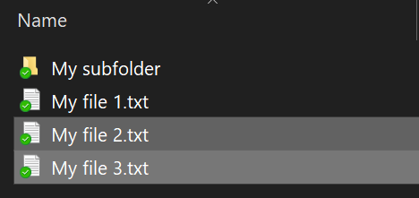
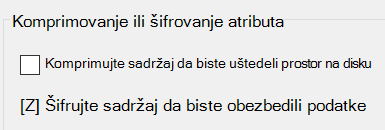

# Šifrovanje datoteka ili fascikli u Windows 10

Možete da šifrujete ceo disk pomoću funkcije BitLocker, ali da biste šifrovali samo pojedinačne datoteke ili fascikle (i njihov sadržaj):

1. U **istraživaču datoteka** izaberite datoteke ili fascikle koje želite da šifrujete. U ovom primeru, izabrane su dve datoteke:

    

2. Kliknite desnim tasterom miša na izabrane datoteke i izaberite stavku **Svojstva.**

3. U prozoru **Svojstva** izaberite stavku **Više opcija.**

4. U prozoru **Više svojstava** potvrdite izbor u polju **za potvrdu Šifruj sadržaj da biste obezbedili** podatke:

    

5. Kliknite na dugme **U redu**.
