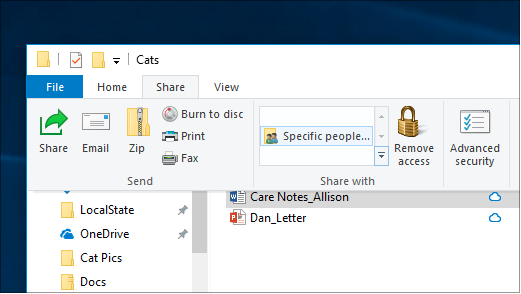
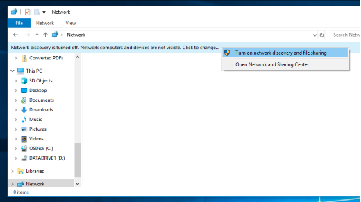

# Deljenje datoteka preko mreže u operativnom sistemu Windows 10

**Napomena**: Ako ste prethodno koristili matičnu grupu za deljenje datoteka, imajte u vidu da je matična grupa uklonjena iz operativnog sistema Windows 10 (verzija 1803). Sada možete da delite štampače i datoteke pomoću ugrađenih funkcija u operativnom sistemu Windows 10.

**Deljenje datoteka ili fascikli preko mreže**

- U **istraživaču datoteka**izaberite datoteku > izaberite karticu **deljenje** na vrhu > u odeljku **Deljenje sa pomoću** izaberite stavku **određene osobe**.

    
          
- Ako istovremeno izaberete više datoteka, možete sve da ih podelite na isti način. Radi i sa fasciklama.

**Da biste videli uređaje na mreži koji dele datoteke**

- U **istraživaču datoteka**idite na **mrežu**. Ako otkrivanje mreže nije omogućeno, videćete poruku o grešci "otkrivanje mreže je isključeno..."

- Kliknite na **otkrivanje mreže** , a zatim izaberite stavku **Uključi otkrivanje mreže i deljenje datoteka**.

    

[Pročitajte više o deljenju datoteka preko mreže](https://support.microsoft.com/help/4092694/windows-10-file-sharing-over-a-network)

[Delite datoteke pomoću aplikacija, OneDrive, e-poruka i još toga](https://support.microsoft.com/help/4027674/windows-10-share-files-in-file-explorer)
