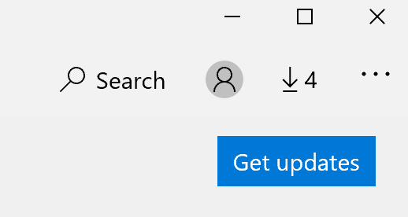

# Popravljanje jezika prikaza aplikacija

Kada promenite jezik prikaza u programu Windows 10, neke aplikacije će možda i dalje koristiti prethodni jezik kada ih otvorite. To se dešava zato što nove verzije aplikacija za taj jezik moraju da se preuzmu iz Prodavnice. Da biste rešili ovaj problem, sačekajte automatsko ažuriranje ili ručno instalirajte ažuriranu verziju aplikacija.

Da biste ručno instalirali ispravku, otvorite Microsoft Store i **izaberite** stavku Preuzimanja i **ispravke** u gornjem desnom uglu. Zatim izaberite **stavku Nabavi ispravke.** Ako se jezik ne promeni nakon dovršavanja ažuriranja, pokušajte ponovo da pokrenete računar.

Da biste pročitali više o postavkama jezika unosa i prikaza, pogledajte upravljanje jezičkim postavkama unosa i prikaza u [programu Windows 10.](https://support.microsoft.com/help/4027670/windows-10-add-and-switch-input-and-display-language-preferences)
