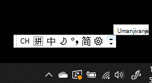
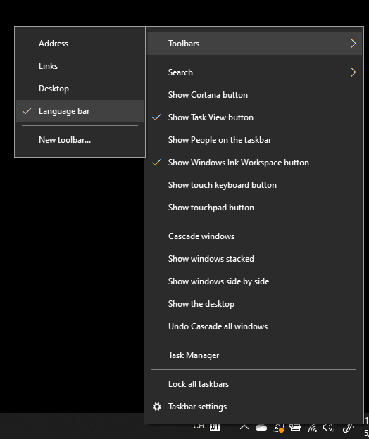
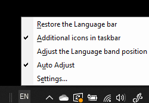

# Skrivanje, prikazivanje ili poništavanje trake jezika

**Da biste umanjili traku jezika:**

Možete da kliknete na dugme umanji u gornjem desnom uglu trake jezika. Ili jednostavno možete da prevučete traku jezika na traku zadataka, što će je automatski umanjiti.

**Da biste iskočili traku jezika:**

Ako ne želite da ukopčate traku jezika na traci zadataka, kliknite desnim tasterom  miša na prazan prostor na traci zadataka i opozijte izbor opcije Traka jezika u meniju Trake sa alatkama. Tako će se traka jezika pojaviti izvan trake zadataka, kao na prethodnom snimku ekrana.

**Da biste vratili traku jezika na podrazumevanu vrednost:**

Kliknite desnim tasterom miša na dugme jezika na traci sa alatkama i izaberite **opciju Vrati opciju trake jezika** u meniju. Ovo će ga vratiti na podrazumevano.

