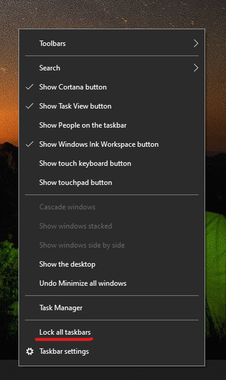

# Premeštanje trake zadataka na bočnu ili na vrh radne površine

Najpre proverite da li je traka zadataka otključana. Da biste proverili da li je vaš otključan, kliknite desnim  tasterom miša na bilo koji prazan prostor na traci zadataka i vidite da li pored trake zadataka postoji znak za proveru Zaključaj. Ako postoji znak za izbor, traka zadataka je zaključana i ne može se premestiti. Kada jednom **kliknete na dugme Zaključaj traku** zadataka, otključaćete je i ukloniti znak za izbor.

Ako imate više monitora koji prikazuju traku zadataka, videćete tekst **Zaključaj sve trake zadataka.**

Kada se traka zadataka otključa, možete da pritisnete i držite bilo koji prazan prostor na traci zadataka i prevučete je na lokaciju koju želite na ekranu. To možete da uradite i tako što ćete kliknuti desnim tasterom miša na prazan prostor na traci zadataka i otići do postavki trake zadataka > lokaciju trake zadataka ** na ekranu.**
