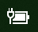

# Ikona napajanja ili baterije nedostaje u Windows 10

Ako Windows 10 uređaj ima bateriju (na primer, laptop ili tablet ili računar povezan putem USB-a sa UPS-om), na traci zadataka se obično nalazi ikona napajanja/baterije u blizini sata, na primer:

Ako ne vidite ovu ikonu, možda je skrivena:

1. Idite na **[Postavke > Personalizacija > zadataka](ms-settings:taskbar?activationSource=GetHelp)**.

2. Na sistemskoj traci poslova **izaberite stavku Izbor ikona koje će se pojavljivati na traci zadataka.**

3. Zatim pronađite **stavku Napajanje** na listi i preklopite njenu postavku na **On**.

    

**Rešavanje problema**

Ako ste pratili gorenavedena uputstva i preklopnik napajanja je zasićen ili nije  vidljiv, u polju za pretragu na traci zadataka ukucajte upravljač uređajima **,** a zatim sa liste rezultata izaberite stavku Upravljač uređajima.  U **okviru Baterije kliknite** desnim tasterom miša na bateriju za uređaj, izaberite stavku Onemogući **,** a zatim kliknite na **dugme Da.** Sačekajte nekoliko sekundi, a zatim kliknite desnim tasterom miša na bateriju i izaberite stavku **Omogući.** Zatim ponovo pokrenite uređaj.

Ako ste pratili gorenavedna uputstva, ali se ikona baterije ne pojavljuje na traci zadataka, u polje za pretragu na traci zadataka ukucajte upravljač zadacima **,** a zatim izaberite stavku **Upravljač** zadacima na listi rezultata. Na kartici **Procesi,** u okviru Ime kliknite **desnim tasterom** miša na **Explorer**, a zatim izaberite stavku Ponovo **pokreni.**
