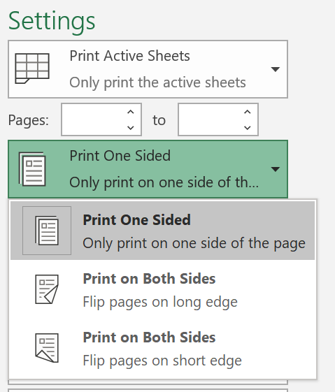
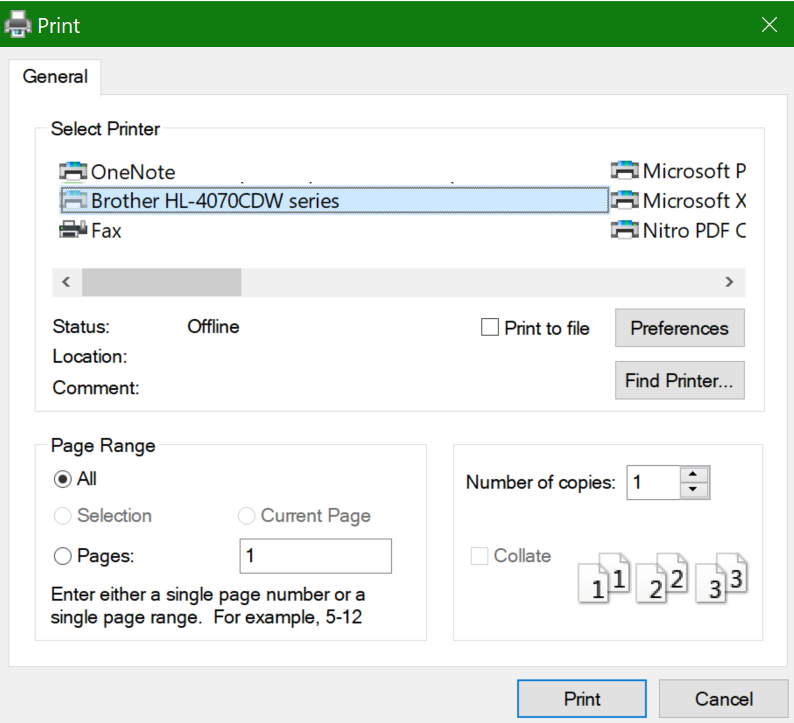

# Štampanje na obe strane papira (obostrano štampanje)

**Da li je moj štampač sposoban za obostrano štampanje?**

Rezime ili ručni rad štampača trebalo bi da vam istakne da li je sposoban da štampa sa obe strane papira, poznat i kao "obostrano štampanje". Ako imate Microsoft Office, drugi način da to saznate je da otvorite Office aplikaciju kao što je Word ili Excel, da biste **> odštampali**, da biste se uverili da je izabran pravi štampač i da potražite mogućnosti u odeljku postavke. Na primer: 

**Obostrano štampanje u sistemu Microsoft Office**

Ako je štampač u stanju da štampa sa obe strane, kada odete u **datoteku > Štampaj** u Office aplikaciji, videćete opciju "Štampaj na obe strane", kao što je prikazano u gorenavedenom primeru.  Izaberite željeni tip obostrano štampanja (Flip na dugu ivicu ili okreni kratku ivicu) i kliknite na dugme **Odštampaj** da biste pokrenuli štampanje.

**Obostrano štampanje iz bilo koje aplikacije**

U mnogim aplikacijama prilikom štampanja videćete opšti dijalog štampanja koji izgleda ovako: 

Uverite se da je izabran pravi štampač, a zatim izaberite stavku **željene postavke** da biste otvorili prozor željene postavke štampača. Ako štampač može obostrano da se odštampa, mogućnost da to omogućite za trenutni posao štampanja prikazaće se u tom prozoru.
