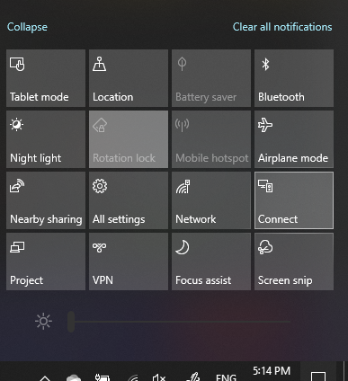

# Project na PC računaru

Na odredišnom uređaju (projektovanje na) potražite "postavke projekcije" da biste otvorili stranicu postavke **projektovanja na ovaj računar**. Zatim se uverite da:
- "Neki Windows i Android uređaji mogu da projektuju na ovaj računar kada izgovorite" u redu "je podešeno da bude **Isključeno**.
- Padajući meni "zatraži od ovog računara" je podešen na **svaki put kada je veza potrebna**.
- Padajuća lista "Zahtevaj PIN za uparivanje" je podešena na " **nikada**".

Na odredišnom uređaju pokrenite stavku **Poveži** aplikaciju tako što ćete otići na **početni ekran** i tražiti "Poveži".

Zatim, na izvornom uređaju od kog pokušavate da projektujete:

1. Pritisnite taster **Windows Key + A** da biste otvorili centar aktivnosti.
2. Kliknite na dugme **Poveži**.
3. Kliknite na uređaj za koji želite da projektujete ekran.

Posle gorenavedenih koraka, odredišni uređaj treba da pokazuje ekran izvornog uređaja kao da je sekundarni monitor.
