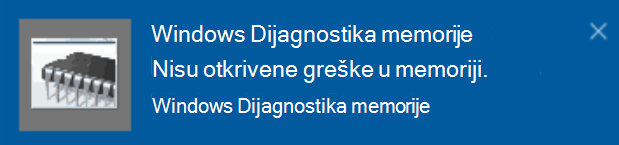

# Pokretanje Windows dijagnostike memorije u operativnom sistemu Windows 10Run Windows Memory Diagnostics in Windows 10

Ako Windows i aplikacije na računaru padnu, zamrznu se ili se ponašaju nestabilno, možda ćete naići na problem sa memorijom računara (RAM).If Windows and apps on your PC are crashing, freezing, or acting in an unstable manner, you may have a problem with the PC’s memory (RAM). Možete da pokrenete Windows dijagnostiku memorije da biste proverili da li ima problema sa RAM memorijom računara.You can run the Windows Memory Diagnostic to check for problems with the PC’s RAM.

U polje za pretragu na traci zadataka ukucajte **dijagnostika memorije**, a zatim izaberite **stavku Windows dijagnostika memorije**.In the search box on your taskbar, type **memory diagnostic**, and then select **Windows Memory Diagnostic**. 

Da biste pokrenuli dijagnostiku, računar mora ponovo da se pokrene.To run the diagnostic, the PC needs to restart. Imate opciju da odmah ponovo pokrenete (sačuvajte to što ste naveli i prvo zatvorite otvorene dokumente i e-poruke) ili da zakažete da se dijagnostika pokreće automatski kada se računar sledeći put pokrene:You have the option to restart immediately (please save your work and close open documents and e-mails first), or schedule the diagnostic to run automatically the next time the PC restarts:

Kada se računar ponovo pokrene, Windows alatka za **dijagnostiku memorije** će se automatski pokrenuti.When the PC restarts, the **Windows Memory Diagnostics Tool** will run automatically. Status i napredak prikazuju se dok se dijagnostika pokreće, a vi možete da otkažete dijagnostiku tako što ćete pritisnuti taster **ESC** na tastaturi.Status and progress will be displayed as the diagnostics run, and you have the option of cancelling the diagnostics by hitting the **ESC** key on your keyboard.

Kada se dijagnostika završi, Windows će početi normalno.When the diagnostics are complete, Windows will start normally.
Odmah nakon ponovnog pokretanja, kada se radna  površina pojavi, pojaviće se obaveštenje (pored ikone centra za obaveštenja na traci zadataka) koje ukazuje na to da li su pronađene bilo kakve greške u memoriji.Immediately after restart, when the Desktop appears, a notification will appear (next to the **Action Center** icon on the taskbar), to indicate whether any memory errors were found. Na primer:For example:

Evo ikone centra aktivnosti:Here's the Action Center icon:  

I probno obaveštenje:And a sample notification: 

Ako ste propustili obaveštenje, možete da izaberete ikonu  centra za obaveštenja na traci zadataka da biste prikazali centar za obaveštenja i videli listu obaveštenja koja se može pomerati. If you missed the notification, you can select the **Action Center** icon  on the taskbar to display the **Action Center** and see a scrollable list of notifications.

Da biste pregledali detaljne informacije, **otkucajte događaj u** polje za pretragu na traci zadataka, a zatim izaberite **stavku Prikazivač događaja**.To review detailed information, type **event** into the search box on your taskbar, and then select **Event Viewer**. U **oknu "Prikazivač** događaja" sa leve strane, izaberite stavke **Windows evidencije > Sistem**.In the **Event Viewer**’s left-hand pane, navigate to **Windows Logs > System**. U desnom oknu pregledajte listu dok  gledate kolonu Izvor dok ne vidite događaje sa izvornom vrednošću **MemoryDiagnostics-Results.**In the right-hand pane, scan down the list while looking at the **Source** column, until you see events with Source value **MemoryDiagnostics-Results**. Istaknite svaki takav događaj i pogledajte informacije o rezultatima u okviru ispod **kartice** Opšte ispod liste.Highlight each such event and see the result information in the box under the **General** tab below the list.
