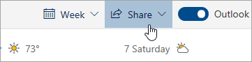

# Deljenje sa Outlookom na Webu

Iz kalendara, na traci sa alatkama na vrhu stranice, izaberite stavku **deli**i odaberite kalendar koji želite da delite.

    

**Napomena**: kalendare u vlasništvu drugih osoba ne možete da delite.

- Unesite ime ili e-adresu osobe sa kojom želite da delite kalendar.
- Odaberite način na koji želite da osoba koristi vaš kalendar:
    - **Može da vidi kada sam zauzet**   omogućava im da vide kada ste zauzeti, ali ne obuhvata detalje kao što je lokacija događaja.
    - **Može da pregleda naslove i lokacije**   omogućava im da vide kada ste zauzeti, kao i naslov i lokaciju događaja.
    - **Može da vidi sve detalje**   omogućava im da vide sve detalje vaših događaja.
    - **Mogu da uređuju**   omogućava da uređuju vaš kalendar.
    - **Delegiranog**   omogućava im da uređuju vaš kalendar i da ga dele sa drugima.
- Izaberite stavku **deli**.
