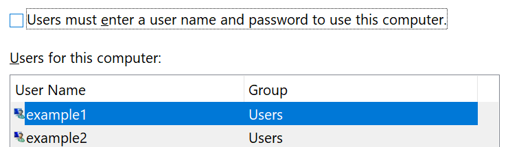

# Prijavljivanje u Windows 10 bez upotrebe lozinkeSign-in to Windows 10 without using a password

Da biste izbegli da otkucate lozinku na Windows pokretanju, preporučujemo vam da koristite neku od Windows Helo bezbednih opcija za prijavljivanje, kao što je PIN, prepoznavanje lica ili otisak prsta, ako je dostupno.To avoid having to type a password at Windows startup, we recommend you use one of the Windows Hello secure sign-in options, like a PIN, face recognition, or fingerprint, if available. Ako zaista želite da onemogućite bezbedno prijavljivanje, pogledajte uputstva "automatski prijavljivanje u Windows 10".If you really want to disable secure sign-in, see the "Automatically sign in to Windows 10" instructions below.

**Bezbedni Windows Helo alternative lozinci za nalog****Secure Windows Hello alternatives to the account password**

**Izaberite stavke postavke > nalozima > opcijama za prijavljivanje** (ili kliknite [ovde](ms-settings:signinoptions?activationSource=GetHelp)).Go to **Settings  > Accounts > Sign-in options** (or click [here](ms-settings:signinoptions?activationSource=GetHelp)). Dostupne opcije za prijavljivanje će biti navedene.Available sign-in options will be listed. Na primer:For example:

Kliknite na neku od opcija da biste je konfigurisali.Click or tap one of the options to configure it. Sledeći put kada pokrenete ili otključate Windows, moći ćete da koristite novu opciju umesto lozinke.Next time you start or unlock Windows, you will be able to use the new option instead of a password. 

**Automatski prijavljivanje u Windows 10****Automatically sign-in to Windows 10**

**Napomena**: automatsko prijavljivanje je zgodno, ali uvodi bezbednosni rizik, naročito ako je računaru pristupačan više osoba.**Note**: Automatic sign-in is convenient, but introduces a security risk, especially if your PC is accessible by multiple people. 

1. Kliknite ili dodirnite dugme **Start** na traci zadataka.Click or tap the **Start** button in the Taskbar.

2. Otkucajte **netplwiz** i pritisnite taster ENTER da biste otvorili prozor korisnički nalozi.Type **netplwiz** and hit the Enter key to open the User Accounts window.

3. U **korisničkim nalozima**izaberite nalog na koji želite da se automatski prijave kada se Windows pokrene.In **User Accounts**, click the account you want to automatically sign in to when Windows starts.

4. Opozovite izbor u polju za potvrdu "korisnici moraju da unesu korisničko ime i lozinku da bi koristili ovaj računar".Uncheck the "Users must enter a user name and password to use this computer" checkbox.

    

5. Kliknite na dugme **U redu**.Click **OK**. Od vas će se tražiti da unesete i potvrdite lozinku za izabrani nalog.You will be asked to enter and confirm the password for the account you selected. Kliknite na dugme **u redu** da biste završili.Click **OK** to finish. Kada se Windows 10 pokrene, on će se automatski prijaviti na nalog koji ste izabrali.Next time Windows 10 starts, it will automatically sign in to the account you selected.
