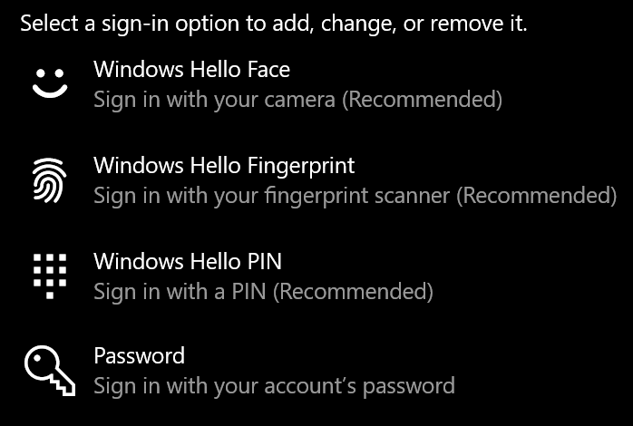
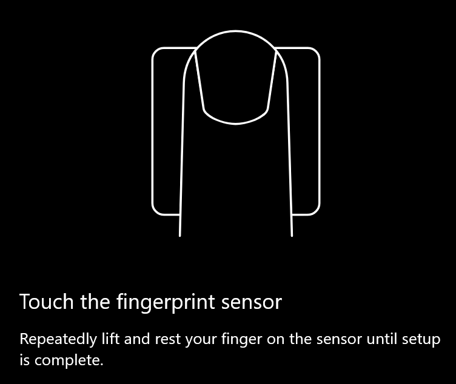
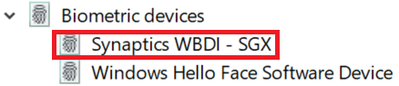

# Opcija za otključavanje otiska prsta u operativnom sistemu Windows 10Use fingerprint unlock option in Windows 10

**Omogućavanje Windows Hello otiska prsta****Enable Windows Hello Fingerprint**

Da biste otključali Windows 10 pomoću otiska prsta, morate da podesite Windows Hello otisak prsta tako što ćete dodati (što će windows učiti da prepozna) najmanje jednim prstom.To unlock Windows 10 using your fingerprint, you need to set up Windows Hello Fingerprint by adding (letting Windows learn to recognize) at least one finger. 

1. Izaberite **stavke Postavke > naloge > za prijavljivanje** (ili kliknite [ovde](ms-settings:signinoptions?activationSource=GetHelp)).Go to **Settings  > Accounts > Sign-in options** (or click [here](ms-settings:signinoptions?activationSource=GetHelp)). Navodi se dostupne opcije za prijavljivanje.Available sign-in options will be listed. Na primer:For example:

    

2. Izaberite ili dodirnite **stavku Windows Hello otisak prsta,** a zatim **izaberite stavku Podešavanje**.Click or tap **Windows Hello Fingerprint**, then click **Set up**. U prozoru za konfigurisanje usluge Windows Hello kliknite na **dugme Prvi koraci.**In the Windows Hello setup window, click **Get started**. Senzor za otisak prsta će se aktivirati i od vas će se tražiti da stavite prst na senzor:The fingerprint sensor will activate, and you'll be asked to place your finger on the sensor:

   

3. Sledite uputstva koja će zatražiti od vas da više puta skenirate prst.Follow the instructions, which will ask you to repeatedly scan your finger. Kada ovo završite, imaćete opciju da dodate druge prste koje ćete možda želeti da koristite za prijavljivanje.When this is finished, you'll have the option of adding other fingers you may want to use for sign-in. Sledeći put kada se prijavite u Windows 10, imaćete opciju da koristite otisak prsta da biste to uraditi.Next time you sign in to Windows 10, you will have the option of using your fingerprint to do so.

**Windows Hello otisak prsta nije dostupan kao opcija za prijavljivanje****Windows Hello Fingerprint not available as a sign-in option**

Ako Windows Hello otisak prsta nije prikazan kao opcija u opcijama za **prijavljivanje,** to znači da Windows ne zna za čitač otisaka prstiju/skener povezan sa računarom ili da sistemske smernice sprečavaju njegovu upotrebu (ako na primer, vašim računarom upravlja vaše radno mesto).If Windows Hello Fingerprint is not shown as an option in **Sign-in options**, it means Windows is not aware of any fingerprint reader/scanner attached to your PC, or that a system policy prevents its use (if for example your PC is managed by your workplace). Da biste rešili problem:To troubleshoot: 

1. Kliknite na **dugme Start** na traci zadataka i potražite stavku **Upravljač uređajima.**Select the **Start** button in the Taskbar and search for **Device Manager**.

2. Izaberite ili dodirnite da biste **otvorili Upravljač uređajima.**Click or tap to open **Device Manager**.

3. U upravljaču uređajima razvijte biometrijske uređaje tako što ćete kliknuti na ševron.In Device Manager, expand Biometric devices by clicking its chevron.

   

4. Skener otisaka prstiju treba da bude naveden kao biometrički uređaj, kao što je Synaptics WBDI skener:Your fingerprint scanner should be listed as a biometric device, such as the Synaptics WBDI scanner:

   

5. Ako skener otisaka prstiju nije prikazan, a skener je integrisan u računar, idite na veb sajt proizvođača računara.If your fingerprint scanner is not shown, and the scanner is integrated into your PC, go to the PC manufacturer's website. U odeljku za tehničku podršku za model računara potražite Windows 10 upravljački program za skener koji možete da instalirate.In the technical support section for your PC model, search for a Windows 10 driver for a scanner that you can install.

6. Ako je skener odvojen od računara (povezan putem USB),idite na veb sajt proizvođača skenera da biste pronašli i instalirali softver upravljačkog programa Windows 10 uređaja za model skenera koji imate.If the scanner is separate from the PC (attached via USB), go to the scanner manufacturer's website to find and install Windows 10 device driver software for the scanner model you have.
