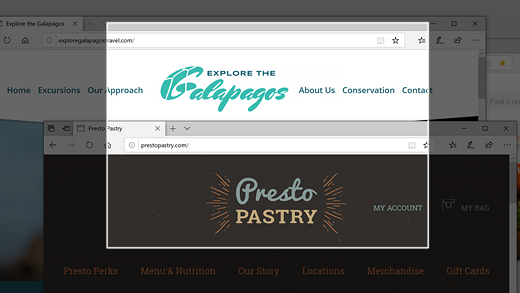
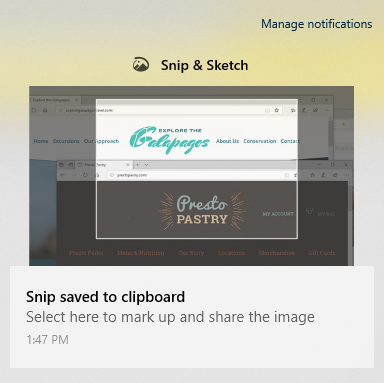

# Korišćenje funkcije "& za & za hvatanje, označavanje i deljenje slika

Ekranske skice se sada **nazivaju Isečci & skica**. **Da biste brzo uzmili rez:**

1. Pritisnite taster sa **Windows logotipom + Shift + S.** Videćete da ekran zatamni, a kursor se prikazuje kao krstić. 

2. Odaberite tačku na ivici oblasti gde želite da kopirate i kliknite levim tasterom miša na kursor. 

3. Pomerite kursor da biste istakli oblast koje želite da uhvatite. Oblast koje uhvatite pojaviće se na ekranu.

   

Slika koju ste isekli čuva se u ostavi, spremna za lep izgled u e-poruku ili dokument. 

**Ako želite da uredite ili prikažete sliku:** 

- Kliknite na ikonu obaveštenja na daleko desnoj strani trake zadataka; a zatim kliknite na sliku koju ste upravo snimili. Vaš & skica se otvara u aplikaciji "& skica".

   
