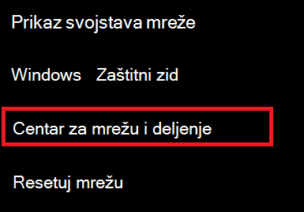
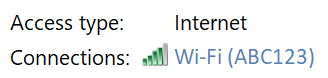
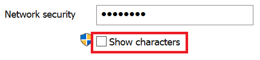

# Prikaz lozinke za Wi-Fi mrežu u operativnom sistemu Windows 10

1. Uverite se da je Windows 10 računar povezan sa Wi-Fi mrežom.

2. Idite na **postavke > Network & internetu > status**ili dodirnite ili dodirnite [ovde](ms-settings:network?activationSource=GetHelp) da biste nas odmah preuzeli.)

3. Izaberite stavku **Centar za mrežu i deljenje**.

    

4. U **centru za mrežu i deljenje**, pored **veza**, videćete ime bežične mreže. Na primer, ako je mreža nazvana "ABC123", možda ćete videti:

    

    Kliknite na ime bežične mreže da biste otvorili prozor Wi-Fi status. 

5. U prozoru Wi-Fi status izaberite stavku **Svojstva bežične**, izaberite karticu **bezbednost** i potvrdite izbor u polju za proveru **znakova**.

    

